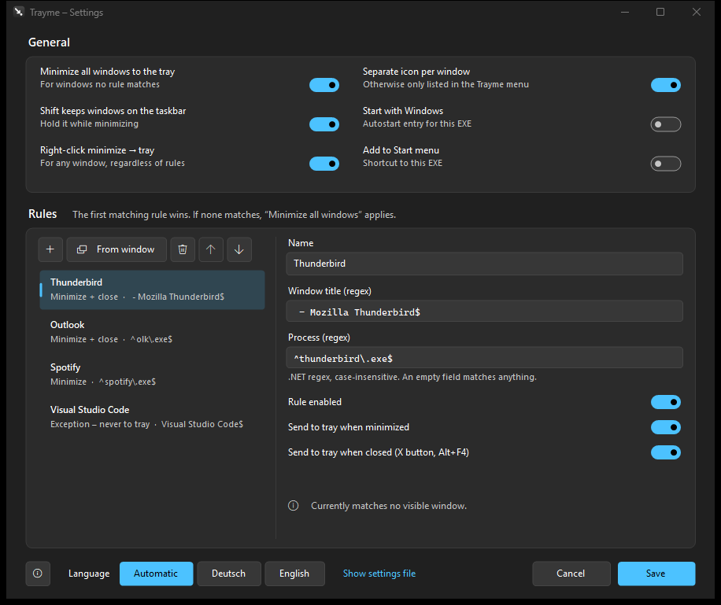

# Trayme

**English** | [Deutsch](README.de.md)

A small portable Windows app that moves windows to the notification area (tray) when you minimize them.
With rules (regex on the window title and/or the process name), windows can also go to the tray when you **close** them.



- A single `Trayme.exe` (~180 KB), no installation; uses the .NET Framework 4.8 that comes with Windows 10/11
- Settings in `Trayme.xml` next to the EXE
- The only changes outside its folder, both optional: the autostart entry under `HKCU\…\Run` and a shortcut in the user's start menu
- English and German UI (follows the Windows language, can be switched in the settings)
- Windows 11 look: follows light/dark mode and the accent color

## Download

- **[Latest release](https://github.com/naderi/trayme/releases/latest)** – download `Trayme.exe`, put it into a folder of your choice and run it.
- Or with [Scoop](https://scoop.sh):

  ```
  scoop bucket add naderi https://github.com/naderi/scoop-bucket
  scoop install naderi/trayme
  ```

## Using it

- **Click the Trayme icon** to open the menu: hidden windows, the switch "Minimize all windows to the tray", settings, about, exit
- **Double-click the Trayme icon** to open the settings
- **Click the icon of a hidden window** to restore it; right-click → "Close program" really closes it
- **Right-click the minimize button** of any window to send it to the tray, regardless of the rules (can be switched off in the settings)
- **Hold Shift while minimizing** to keep a window on the taskbar just this once
- **Exiting** Trayme restores all hidden windows
- Starting `Trayme.exe` a second time opens the settings of the running instance
- **About** (in the menu, or the ⓘ button at the bottom left of the settings) shows the version, the developer, the GitHub link and program updates

## Rules

The first matching rule wins; if none matches, "Minimize all windows to the tray" applies.

| Field | Meaning |
|---|---|
| Window title (regex) | .NET regex, case-insensitive, e.g. ` - Mozilla Thunderbird$` |
| Process (regex) | name of the EXE, e.g. `^thunderbird\.exe$` |
| Send to tray when minimized | hide the window when it is minimized |
| Send to tray when closed | the X button and Alt+F4 hide the window instead of closing it |

An empty field matches anything; a rule without any pattern is ignored.
Both switches off = exception (the window never goes to the tray).
"From window" creates a rule from a window that is currently open.

## Limits

- "Send to tray when closed" intercepts the X button (via a mouse hook and `WM_NCHITTEST`) and Alt+F4.
  It does **not** intercept "Close" in the system menu, "Close window" on the taskbar or exiting through the program's own menu –
  that would require injecting a DLL into other processes.
- Windows of programs running as administrator can only be hidden when Trayme itself runs as administrator.
- Apps with their own title bar work as long as they report at least one title bar button via `WM_NCHITTEST` (most modern apps do);
  the position of the buttons then comes from DWM. Apps that report none (e.g. Audacity 4) are not recognized for right-click minimize and the X button.

## Program updates

Trayme updates itself from the [releases of this repository](https://github.com/naderi/trayme/releases):

- Once a day it looks for a new version in the background (can be switched off in the about window: *Check automatically (once a day)*). A new version is announced once with a notification balloon, and the ⓘ button in the settings gets an orange dot.
- In the about window: *Check for updates* → *Download update* → *Restart & update*.
- A download is only used if its signature (`.sig`) matches the key built into Trayme; anything else is rejected. Hidden windows are restored before the restart, and `Trayme.xml` stays untouched.
- Installed with Scoop, Trayme only points to `scoop update trayme`.

## License

Freeware – free to use, but **not for sale**. See [LICENSE](LICENSE).

© 2026 [Ali Naderi](https://github.com/naderi)
